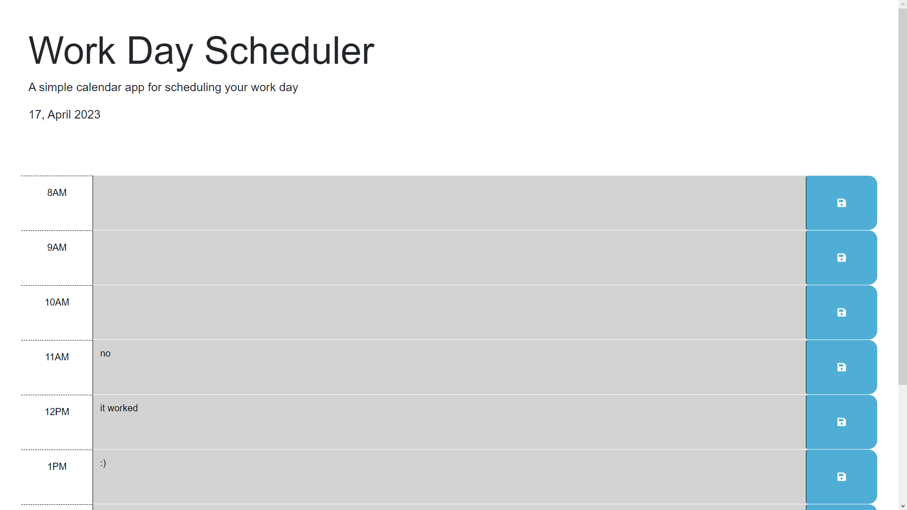

# Sceduler

## Description

Provide a short description explaining the what, why, and how of your project. Use the following questions as a guide:

    This project is a daily planner, it keeps track of time as well as saving comments. My motivation for this project was, learing how to use JQUERY and DAYJS. This project would allow a user to manage their scedule and set reminders. After completing this project I feel I have learned how to navigate the DOM with jquery, work with time is DAYJS. Most importantly I became far more comfortable looking through the documentation.

## Usage

Go to this link to see the website.
https://nathansabin.github.io/Sceduler/
To see the code got to this link.
https://github.com/nathansabin/Sceduler

## Features

    You have nine boxes grey if you are past that hour in the day, red if you are in that hour, green if it is in the future. On the top of the page it will display the current day. If you enter text into one of the boxs then press the save button, you can refresh the page and your text will have been saved. 

## Tests

I made sure to watch the box adjust over as an hour changes, I have saved text into this program successfully.